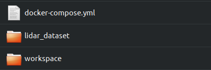
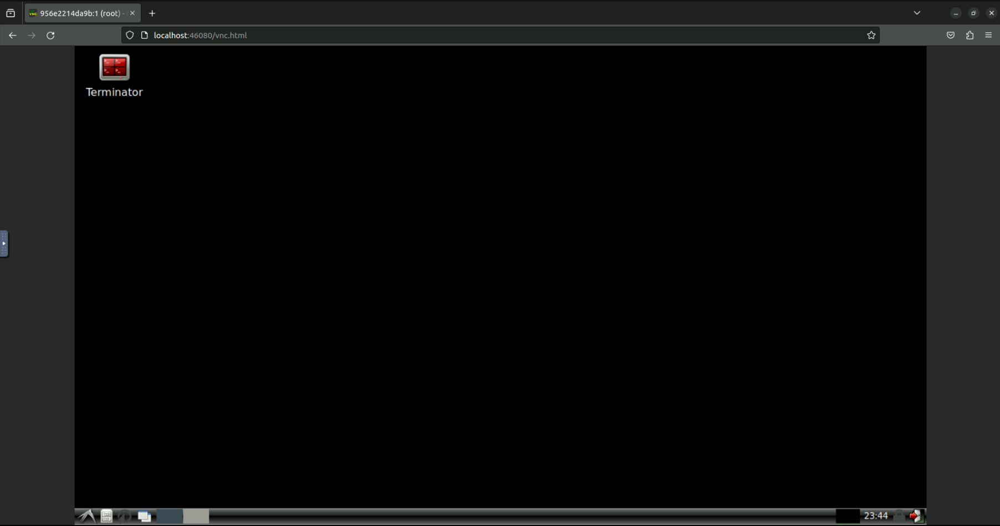

# ig_lio_workspace

This Docker is a standard development environment for [iG-LIO](https://github.com/zijiechenrobotics/ig_lio), which helps you quickly experience iG-LIO. The Docker is visualized via [VNC](https://github.com/TigerVNC/tigervnc), [noVNC](https://github.com/novnc/noVNC), and Xserver, allowing users to see the trajectory and mapping in real time.

|                Supported scheme                 | Viusal manner |
| :---------------------------------------------: | :-----------: |
| Ubuntu (any version) with GPU **(recommended)** |    Xserver    |
|               Ubuntu without GPU                | VNC or noVNC  |
|                Windows with GPU                 |    Xserver    |
|               Windows without GPU               | VNC or noVNC  |

Since Docker utilizes the CPU to render frames in VNC, RViz may experience delays when visualizing dense point clouds. **It is advisable to use `sparse_map(VNC)` to visualize the global map in RViz.**


## 1. Quick Start
### 1.1 Install Docker

Please install Docker following the links. This Docker supports both Ubuntu and Windows.

- Ubuntu: install [Docker engine](https://docs.docker.com/engine/install/ubuntu/) and [nvidia-docker](https://docs.nvidia.com/datacenter/cloud-native/container-toolkit/latest/install-guide.html).
- Windows (without GPU): If you plan to visualize in VNC, just install [Docker desktop](https://docs.docker.com/desktop/install/windows-install/). 
- WIndows (with GPU): If you want to GPU acceleration, you should install docker engine in `WSL2`, and then install `NVIDIA Container Toolkit` on `WSL2`. It is recommended that follow this [tutorial](https://www.youtube.com/watch?v=CO43b6XWHNI).

### 1.2 Pull Container

```bash
docker pull zijiechenrobotic/ig-lio-workspace:latest

# for Chinese mainland
docker pull registry.cn-guangzhou.aliyuncs.com/zijiechenrobotics/ig-lio-workspace:latest
```

### 1.3 Launch Container

If you are not interested in the Docker's source code, **you do not need to git clone**. Simply create a new workspace in the following format.



```bash
# the "lidar_dataset" folder is used to store the datasets

# download iG-LIO source code
cd workspace
git clone https://github.com/zijiechenrobotics/ig_lio.git
git clone https://github.com/Livox-SDK/livox_ros_driver.git
```

#### 1.3.1 Launch Container in Ubuntu with GPU (recommend)

Enter the below contents in the `docker-compose.yml`

```yaml
version: '3.4'
services:
  ig-lio-workspace:
    build:
      context: .
    image: zijiechenrobotic/ig-lio-workspace:latest
    # or
    # registry.cn-guangzhou.aliyuncs.com/zijiechenrobotics/ig-lio-workspace:latest
    environment:
      - DISPLAY=$DISPLAY
      - QT_X11_NO_MITSHM=1
      - NVIDIA_DRIVER_CAPABILITIES=all
      - NVIDIA_VISIBLE_DEVICES=all
    deploy:
      resources:
        reservations:
          devices:
            - driver: nvidia
              count: 1
              capabilities: [ gpu ]
    volumes:
      # Map ig-lio source code to Docker (please change to your own path)
      - <your workspace folder path>:/root/workspace
      # Map datasets to Docker (Please change to your own path)
      - <your lidar_dataset folder path>:/root/lidar_dataset
      - /tmp/.X11-unix:/tmp/.X11-unix:rw
```

Launch container

```bash
# cd to ig_lio_workspace
docker compose up -d
```

Shut down container

```bash
# cd to ig_lio_workspace
docker compose down
```

**Access Container**

```bash
# enter below command in the local terminal (necessary)
xhost +local:root

# access container
docker exec -it <containter id> bash

# check opengl is rendered by GPU
inxi -G
# output-> OpenGL: renderer: <your GPU namae> instead of llvmpipe
```


#### 1.3.2 Launch Container in Windows with GPU

Coming soon...

#### 1.3.3 Launch Containter with VNC

```bash
version: '3.4'
services:
  ig-lio-workspace:
    build:
      context: .
    image: zijiechenrobotic/ig-lio-workspace:latest
    # or 
    # registry.cn-guangzhou.aliyuncs.com/zijiechenrobotics/ig-lio-workspace:latest
    environment:
      - VNC_PW=abc123 # user defined password
      - VNC_GEOMETRY=1280x720 # vnc resolution
      - VNC_DEPTH=24 # 16/24/32
    volumes:
      # Map ig-lio source code to Docker (please change to your own path)
      - <your workspace folder path>:/root/workspace
      # Map datasets to Docker (Please change to your own path)
      - <your lidar_dataset folder path>:/root/lidar_dataset
    ports:
      # noVNC port:
      - 46080:6080
      # standard VNC port:
      - 45901:5901
```

Launch container

```bash
# cd to ig_lio_workspace
docker compose up -d
```

Shut down container

```bash
# cd to ig_lio_workspace
docker compose down
```

**Access via VNC**

Enter the following address to access Docker via any VNC viewer ( recommend Windows uses MobaXterm and Ubuntu uses Remmina)

```
localhost:45901
```

**Access via noVNC (recommend)**

Any browser, enter the following address in the address bar

```
localhost:46080/vnc.html
```



### 1.5 Run

```bash
# build iG-LIO
cd /root/workspace/ig_lio
catkin_make

# launch iG-LIO
source devel/setup.bash
roslaunch ig_lio lio_<dataset name>.launch
```

Since we have mapped the datasets to the `lidar_dataset`, we can play the datasets inside Docker

```bash
# open another terminal
cd /root/lidar_dataset
rosbag play <dataset name>
```

## Docker Environment

```
base: nvidia/opengl:1.0-glvnd-runtime-ubuntu20.04
ROS noetic
evo
gcc9 & g++9
glog
git
```

